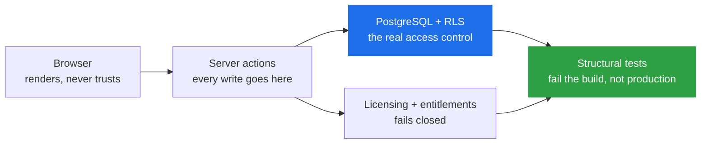
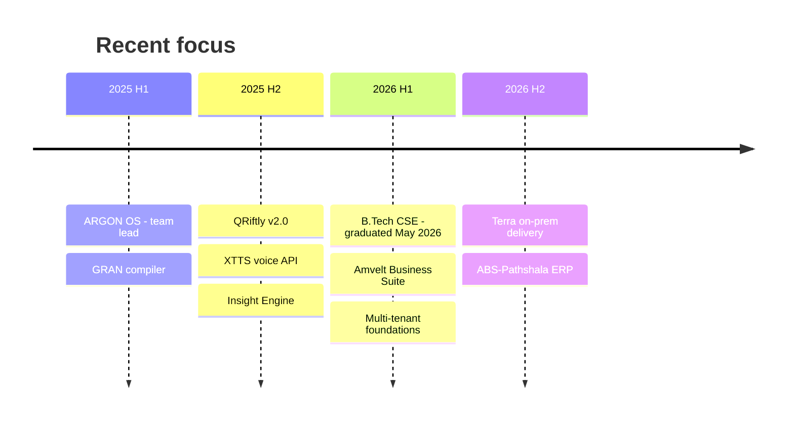

# Anubhav Mishra

**I build multi-tenant SaaS and self-hosted enterprise software.**
*Mostly TypeScript, Next.js and PostgreSQL — where getting authorization wrong is a data breach, not a bug ticket.*

 

---

> [!NOTE]
> **Right now:** building **Terra** — land, legal and approvals management for renewable-energy
> developers, delivered as licensed Docker images onto the customer's own servers — and
> **ABS-Pathshala**, a multi-tenant education ERP. Both at [Amvelt Venture Studios](https://mishraanubhav.me).

---

## The short version

| | |
|---|---|
| **What I do** | Full-stack product engineering, leaning backend and platform |
| **Best at** | Multi-tenant architecture, Postgres row-level security, auth &amp; licensing, shipping software that runs on someone else's infrastructure |
| **Daily stack** | TypeScript · Next.js · PostgreSQL · Supabase · Prisma · Docker |
| **Also fluent** | Python (FastAPI) · C / C++ · systems &amp; compilers |
| **Background** | B.Tech CSE, Graphic Era Hill University (May 2026) · led a 4-person OS team · wrote an LLVM compiler |
| **Based in** | Dehradun, Uttarakhand, India · IST (UTC+5:30) |
| **Looking for** | Remote full-stack / backend roles, and freelance work on SaaS products |

---

## How I think about building things

Hiding a button is not security. If a user shouldn't read a row, the *database* should be
what stops them — and a test should fail the build the day someone forgets that.

---

## Selected work

<table>
<tr><td width="50%" valign="top">

### 🌍 Terra
**Land lifecycle platform · renewable energy**

Next.js + self-hosted Supabase. GIS mapping, legal/TSR
tracking, a document vault, approvals and payments —
running entirely on the customer's own server.

`Next.js` `TypeScript` `PostgreSQL` `Docker` `MinIO`

</td><td width="50%" valign="top">

### 🎓 ABS-Pathshala
**Multi-tenant education ERP SaaS**

ERPNext is the ERP a school runs. This is the platform
that runs hundreds of them — provisioning, billing and
operating one instance per institution.

`Next.js 15` `Prisma` `pnpm` `Postgres RLS`

</td></tr>
</table>

<b>🔎 Terra — what's actually interesting about it</b>

 

Terra is one Next.js application plus a self-hosted Supabase stack (GoTrue, PostgREST,
storage-api on MinIO, Valkey, a pg-boss worker). Customers never receive source — they get
pre-built Docker images, generate their own secrets, and run it themselves.

**The parts I'd want to talk through in an interview:**

- **164 row-level-security policies** are the primary access control. Server actions are a
  *second* layer, not the first. Hiding UI protects nothing.
- **Ed25519-signed licences bound to machine hardware.** Entitlements fail closed — no valid
  licence means paid modules are simply off, not degraded.
- **Three structural tests that fail your PR by design** — a server action with no auth call,
  a gated feature with no entitlement check, or an undocumented `SECURITY DEFINER` function
  all break the build.
- **Split test suites, deliberately.** Unit tests run on a clean checkout with no Docker so CI
  can run them on every push; integration tests bring up real Postgres and assert what the
  *database* enforces, because testing RLS against a mock proves nothing.
- **Approval authority is a function, not a comparison.** `top_management` sits above
  `division_vp` in tier order but deliberately cannot approve — a naive tier comparison would
  silently grant authority the design withholds.
- Handling real landowner PII means DPDP Act obligations are a design constraint, not an afterthought.

Documented with ADRs, runbooks, a threat model and a backup/restore policy.

<b>🔎 ABS-Pathshala — multi-tenancy done carefully</b>

 

A pnpm monorepo: Next.js 15 app, a framework-free `core` package, Prisma + RLS in `db`, a
shared design system. One deployable, many tenants.

- **Tenant identity comes from the `Host` header only** — never a query param, body field or
  client-settable header. Middleware strips inbound `x-tenant-*` headers before routing.
- **`withTenant()` sets `app.tenant_id` transaction-locally**, which is what makes connection
  pooling safe under multi-tenancy.
- **`DATABASE_URL` must point at `abs_app`, never `postgres`** — Supabase's `postgres` role has
  `rolbypassrls`, so that one mistake disables every isolation policy silently, with no error
  and no log line.
- **`rls-coverage.test.ts` fails the build** if any tenant-scoped table lacks
  `FORCE ROW LEVEL SECURITY`.
- **11 ADRs**, an EARS-format PRD, and a 326-item feature register tracked honestly — the
  README states plainly that ~21% is built and lists exactly what isn't.

Five portal-scoped auth sessions (master, admin, teacher, student, parent), RLS isolation
across 40 tables, self-serve provisioning.

<b>🔎 Open source &amp; public projects</b>

 

| Project | What it is | Stack |
|---|---|---|
| **[QRiftly](https://github.com/anubhav-n-mishra/Desktop-QR-Scanner)** ⭐10 | Shipped Windows QR scanner — popup camera, theming, WiFi auto-connect from QR, fully offline. Distributed as a signed `.exe`. | `Python` `OpenCV` `pyzbar` `Tkinter` |
| **[XTTS-v2 TTS API](https://github.com/anubhav-n-mishra/xtts-api)** ⭐3 | Production TTS API — voice cloning, 17 languages, tiered auth, rate limiting, async job queue, audio caching, usage analytics, admin dashboard. | `FastAPI` `Docker` `SQLite` `Coqui XTTS` |
| **[ARGON OS](https://github.com/anubhav-n-mishra/AGRAN_OS)** | x86 OS from scratch — custom bootloader, protected-mode switch, round-robin scheduler, in-memory FS, interactive shell. **I led a team of 4** on architecture, integration and the bootloader/toolchain. | `C` `NASM` `QEMU` `i686-elf` |
| **[GRAN](https://github.com/anubhav-n-mishra/GRAN)** | Statically-typed language with a real **LLVM-19 backend** — lexer, recursive-descent parser, IR generation, C runtime library. Academic team project. | `C++` `LLVM` `Make` |
| **[Automated Insight Engine](https://github.com/anubhav-n-mishra/Automated-ai-insight-system)** | Raw data → ranked insights → generated PowerPoint + AI voice briefing + QR-gated live dashboard. Polars over Pandas, DuckDB for joins. | `FastAPI` `Polars` `DuckDB` `Gemini` |
| **[POI Blueprint Inspector](https://github.com/anubhav-n-mishra/POI_INSPECTOR)** | Scores point-of-interest polygon accuracy against satellite imagery — IOU, leakage, road overlap — with a weighted 0–100 grade and PDF reports. | `FastAPI` `OpenCV` `Shapely` `Next.js` |

---

## Tools, honestly sorted

> [!TIP]
> Everyone lists thirty logos. Here's the version that's actually useful to you.

<table>
<tr>
<td valign="top" width="33%">

**I'd defend these in an interview**

`TypeScript` `Next.js`
`PostgreSQL` `SQL + RLS`
`React` `Node.js`
`Python` `FastAPI`
`Docker` `Supabase`
`C` `Git`

</td>
<td valign="top" width="33%">

**Used in real projects**

`Prisma` `pnpm` `Vitest`
`C++` `LLVM` `NASM`
`Tailwind` `MinIO / S3`
`OpenCV` `Polars` `DuckDB`
`GitHub Actions` `Linux`

</td>
<td valign="top" width="33%">

**Currently learning**

`Distributed systems`
`Observability & tracing`
`Payments at scale`
`Background job architecture`
`Kubernetes`

</td>
</tr>
</table>

---

## What I'm working on

- 🏗️ Hardening **Terra** toward its first production go-live
- 🧩 Building out **ABS-Pathshala** — admissions, payments and background jobs are next
- 📚 Reading more on distributed systems and production observability
- 🤝 Taking on **select freelance work** — SaaS products, Postgres-heavy backends, Next.js apps

---

## Let's talk

I'm open to **remote full-stack / backend roles** and **freelance projects**.

If you're building a SaaS product and the words *"multi-tenant"*, *"row-level security"* or
*"we need to self-host this for a client"* are in your near future — that's my favourite kind of problem.

 

Based in Dehradun, India (IST, UTC+5:30) · Usually reply within a day · Comfortable overlapping with EU and US-East hours

