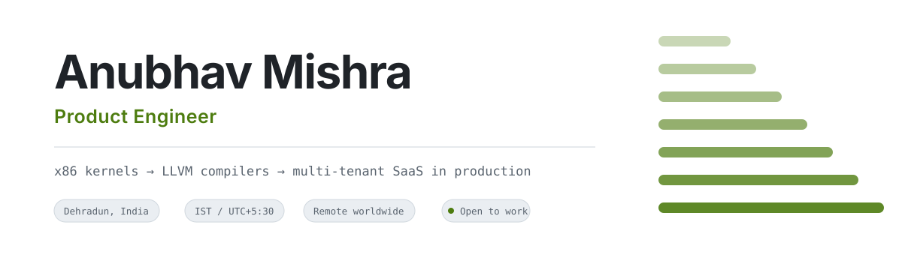
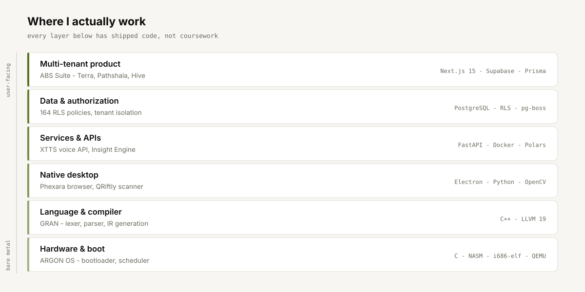
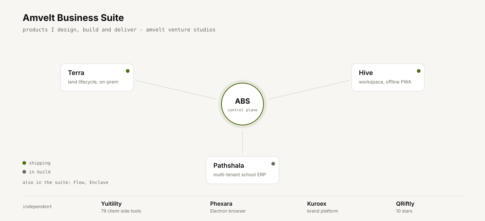

<picture>
  <source media="(prefers-color-scheme: dark)" srcset="assets/hero-dark.svg">
  
</picture>

I build products end to end. Some of them run on customers' own servers behind a licence
check, some run in a browser tab, and one of them boots off a floppy image in QEMU.

I run engineering at **Amvelt Venture Studios**, where I design and ship the ABS product
suite. Before that I led a four-person team building an x86 operating system from the
bootloader up, and wrote a compiler with a real LLVM backend. I mention those two not
because they pay the bills, but because they are why I am comfortable anywhere in a stack.

---

## Live, in production

Things you can go and look at right now — not demos, not screenshots.

| | What it is | Where |
|---|---|---|
| **Terra** | Land, legal and approvals platform for renewable-energy developers. Ships as licensed Docker images onto the customer's own infrastructure. | [terra.amvelt.com](https://terra.amvelt.com) |
| **Seva Sankul** | Public platform and admin portal delivered under subcontract to **GTO Sky for the Rajasthan Police**. | [sevasankul.org](https://sevasankul.org) |
| **ABS Hive** | Amvelt's internal workspace — projects, tasks, internal `@amvelt.com` mail, live chat, full audit trail. Installable PWA that keeps working with no network. | [hive.amvelt.com](https://hive.amvelt.com) *(login required)* |
| **Yuitility** | 79 client-side tools — PDF suite, image processing, local-ML background removal. Nothing ever leaves your browser. | *link on request* |
| **Phexara / Nebula** | Chromium desktop browser. Workspaces instead of tabs, Ctrl+K command bar, built-in AI console. Windows installer + Linux AppImage. | *download on request* |

---

<picture>
  <source media="(prefers-color-scheme: dark)" srcset="assets/layers-dark.svg">
  
</picture>

> [!NOTE]
> That diagram is the whole point. Most people who write Next.js have never written a
> bootloader, and most people who write bootloaders have never shipped a multi-tenant SaaS
> to a paying customer. I have done both, and the middle is where the interesting problems live.

---

<picture>
  <source media="(prefers-color-scheme: dark)" srcset="assets/suite-dark.svg">
  
</picture>

<b>Terra</b> — on-prem enterprise delivery, and why it is hard

 

One Next.js app plus a self-hosted Supabase stack — GoTrue, PostgREST, storage-api on MinIO,
Valkey, a pg-boss worker. Customers never receive source. They get pre-built Docker images,
generate their own secrets, and run the whole thing themselves.

- **164 row-level-security policies** are the primary access control. Server actions are the
  *second* layer, not the first. Hiding a button protects nothing.
- **Ed25519-signed licences bound to machine hardware.** Entitlements fail closed — no valid
  licence means paid modules are off, not degraded.
- **Three structural tests fail your PR by design**: a server action with no auth call, a gated
  feature with no entitlement check, or an undocumented `SECURITY DEFINER` function.
- **Split test suites, deliberately.** Unit tests run on a clean checkout with no Docker so CI
  can run them every push. Integration tests bring up real Postgres and assert what the
  *database* enforces — testing RLS against a mock proves nothing.
- **Approval authority is a function, not a comparison.** `top_management` sits above
  `division_vp` in tier order but deliberately cannot approve. A naive tier comparison would
  silently grant authority the design withholds.
- Real landowner PII means DPDP Act obligations are a design constraint, not an afterthought.

ADRs, runbooks, a threat model, and a documented backup/restore policy.

<b>ABS Hive</b> — offline-first, and the dedup problem nobody mentions

 

An installable PWA that genuinely works with no network, not one that shows a sad cloud icon.

- **Every write goes into an IndexedDB outbox first** and replays when the network returns.
  Duplicate replays are impossible because each payload carries a `client_id` that is `UNIQUE`
  in Postgres — the database refuses the second copy rather than the client trying to remember.
- Replays give up after eight attempts, so one poisoned row cannot wedge the whole queue.
- **Chat sends over Realtime broadcast first, database write reconciles behind it**, so delivery
  feels instant. The broadcast is a latency optimisation, never the delivery guarantee.
- **Web Push via VAPID**, fanned out by a Postgres trigger calling a Supabase Edge Function, so
  alerts arrive with the app fully closed.
- **Passkeys (WebAuthn) and TOTP.** Admin accounts cannot get in on a password alone — enforced
  server-side in the layout, not hidden in the UI.
- Identity provisioning mints `first.last@amvelt.com`, emails credentials over SMTP, and forces
  a password change at first sign-in.

Interface follows Apple's fluid-interface principles: feedback on pointer-down rather than
release, drags tracking one-to-one, flicks resolved by projecting release velocity.
`prefers-reduced-motion`, `prefers-reduced-transparency` and `prefers-contrast` all honoured.

<b>ABS Pathshala</b> — multi-tenancy where a mistake is a cross-tenant leak

 

ERPNext is the ERP a school runs. Pathshala is the platform that runs hundreds of them.

- **Tenant identity comes from the `Host` header only** — never a query param, body field or
  client-settable header. Middleware strips inbound `x-tenant-*` headers before routing.
- **`withTenant()` sets `app.tenant_id` transaction-locally**, which is what makes connection
  pooling safe under multi-tenancy.
- **`DATABASE_URL` must point at `abs_app`, never `postgres`** — Supabase's `postgres` role has
  `rolbypassrls`, so that single mistake disables every isolation policy silently, with no
  error and no log line.
- **`rls-coverage.test.ts` fails the build** if any tenant-scoped table lacks `FORCE ROW LEVEL SECURITY`.
- **11 ADRs**, an EARS-format PRD, and a 326-item feature register tracked honestly — the repo
  states plainly that ~21% is built and lists exactly what is not.

<b>Yuitility</b> — 79 tools, zero servers, and an SEO gate in CI

 

A client-side utility suite: PDF merge/split/compress/watermark, image conversion and
compression, local-ML background removal via WebAssembly, fake-data generation, financial
calculators. Everything runs in the browser — no upload, no round trip, no privacy question.

The part I am actually proud of is the discipline around it. 49 further tools are declared but
unbuilt, and those routes serve an honest "not built yet" page marked `noindex`, so the site
never competes in search for something it cannot do. `npm run seo:audit` runs as `prebuild` and
**adding a tool id without a matching component fails the build.**

---

## Selected engineering

| Project | What makes it worth a look | Stack |
|---|---|---|
| **[QRiftly](https://github.com/anubhav-n-mishra/Desktop-QR-Scanner)** ⭐10 | Shipped Windows app, distributed as a standalone `.exe`. Popup camera, theming, WiFi auto-connect straight from a QR. Fully offline. | `Python` `OpenCV` `pyzbar` |
| **[XTTS Voice API](https://github.com/anubhav-n-mishra/xtts-api)** ⭐3 | Production TTS — voice cloning, 17 languages, tiered auth, rate limiting, async job queue, audio caching, usage analytics, admin dashboard. | `FastAPI` `Docker` `Coqui XTTS` |
| **[ARGON OS](https://github.com/anubhav-n-mishra/AGRAN_OS)** | x86 OS from scratch — bootloader, protected-mode switch, round-robin scheduler, in-memory FS, interactive shell. **I led the team of four**: architecture, integration, bootloader, toolchain. | `C` `NASM` `QEMU` `i686-elf` |
| **[GRAN](https://github.com/anubhav-n-mishra/GRAN)** | Statically-typed language on a real **LLVM-19 backend** — lexer, recursive-descent parser, IR generation, C runtime library. | `C++` `LLVM` `Make` |
| **[Insight Engine](https://github.com/anubhav-n-mishra/Automated-ai-insight-system)** | Raw CSV/SQL → ranked insights → generated PowerPoint + 30-second AI voice briefing + QR-gated live dashboard. Polars over Pandas, DuckDB for joins. | `FastAPI` `Polars` `DuckDB` `Gemini` |
| **[POI Inspector](https://github.com/anubhav-n-mishra/POI_INSPECTOR)** | Scores point-of-interest polygons against satellite imagery — IOU, leakage, road overlap — into a weighted 0–100 grade with PDF reports. | `FastAPI` `OpenCV` `Shapely` `Next.js` |

---

## Tools, sorted honestly

<table>
<tr>
<td valign="top" width="34%">

**Would defend in an interview**

`TypeScript` · `Next.js`
`PostgreSQL` · `SQL + RLS`
`React` · `Node.js`
`Python` · `FastAPI`
`Docker` · `Supabase`
`C` · `Git`

</td>
<td valign="top" width="33%">

**Shipped real things with**

`Prisma` · `pnpm` · `Vitest`
`C++` · `LLVM` · `NASM`
`Electron` · `WebAssembly`
`Tailwind` · `MinIO / S3`
`OpenCV` · `Polars` · `DuckDB`
`WebAuthn` · `Web Push`

</td>
<td valign="top" width="33%">

**Currently learning**

`Distributed systems`
`Observability & tracing`
`Payments at scale`
`Kubernetes`

</td>
</tr>
</table>

---

## What I'm on right now

- Driving **Terra** through its production go-lives, and the on-prem delivery pipeline around it
- Building out **ABS Pathshala** — admissions, payments and background jobs are next
- Growing **Yuitility** past 79 tools, with the SEO gate holding the line
- Taking **select freelance work** — SaaS products, Postgres-heavy backends, on-prem delivery

---

### Let's talk

Open to **remote engineering roles** and **freelance projects**.

If the words *multi-tenant*, *row-level security*, or *"we need to self-host this for a client"*
are anywhere in your next six months — that is my favourite kind of problem.

 

Dehradun, India · IST (UTC+5:30) · comfortable overlapping EU and US-East hours · usually reply within a day

